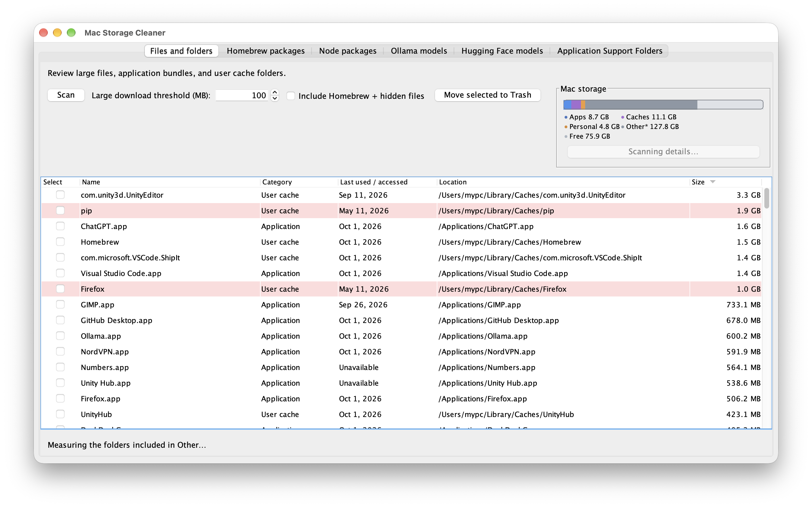

# Mac Storage Cleaner

A small Java 17 desktop app for finding storage that may be worth reviewing on macOS.



## What it scans

- Application bundles in `/Applications` and `~/Applications`.
- Immediate subfolders in `~/Library/Caches`.
- Files in `~/Downloads` at or above the configurable size threshold (100 MB by default).
- When **Include Homebrew + hidden files** is checked, large package folders in common Homebrew Cellar/Caskroom paths and individual large files inside hidden home folders. This deeper scan is opt-in; hidden folders themselves are never offered for removal.
- A stacked storage bar in the app's upper-right corner, refreshed by Scan. It shows the volume's total/free space and estimates Applications, Caches, and common personal folders; remaining usage is grouped as Other.

The app reports sizes and locations. The Applications graph segment counts discovered `.app` bundles; app support data and Homebrew remain part of Other. The operating system supplies the volume capacity and available space; category sizes are estimates from readable folders, so protected files, snapshots, and shared storage can make the breakdown differ from macOS Storage settings. It cannot reliably tell whether an application is unused, so application bundles and caches are review candidates, not recommendations to remove. Scanning does not change files. Selected items are sent to the macOS Trash through Finder, and the app never empties the Trash. Permission-restricted items may be skipped.

The Homebrew packages tab shows measured disk usage for each installed formula and cask folder when you refresh the list. Shared dependency files may be included in more than one package total, and unreadable or missing folders show as unavailable. The Ollama models tab lists local models and their sizes as reported by `ollama list`. Select one or more models and choose Remove selected to uninstall them with `ollama rm`; the app asks for confirmation first. Ollama must be installed and available in the app process PATH. The Hugging Face models tab checks `~/.cache/huggingface/hub` for model repositories and reports the size of each repository's blob storage. It does not modify the cache.

The Node packages tab lists packages installed globally in npm's active prefix, measures each package folder, and can uninstall selected packages with `npm uninstall --global` after confirmation. npm must be available in the app process PATH. Node version managers can maintain separate npm installations and global package lists, so the tab shows the packages for the npm executable found on PATH.

## Run

Install Java 17 or newer, open Terminal in this folder, and run:

```sh
./run.command
```

The launcher compiles all Java source files into a temporary directory and starts the app. Maven is optional. On macOS you can also double-click `run-mac-storage-cleaner.command` from Finder.

## Run tests

Install Java 17 or newer and Maven, then run the test suite from the project folder:

```sh
mvn test
```

The tests use temporary directories for filesystem scanning and sizing checks; they do not remove real files or uninstall packages.

## Format Java code

The project uses Google Java Format through the Spotless Maven plugin. Apply formatting with:

```sh
mvn spotless:apply
```

Check formatting without changing files with:

```sh
mvn spotless:check
```

## Architecture

- `domain` contains the storage candidate and package data records plus the storage allocation model.
- `infrastructure` contains filesystem scanning, folder sizing, and the macOS Finder Trash adapter.
- `Main` is the application entry point and builds the primary scan screen.
- `presentation/homebrew`, `presentation/node`, `presentation/models`, and `presentation/support` group each feature tab with its table model.
- `presentation/files` contains the candidate table model and allocation bar.
- `pom.xml` builds the runnable JAR with Maven.

The first version intentionally focuses on a transparent scan and reversible cleanup. Future additions could include storage summaries, duplicate detection, and app usage history where macOS provides reliable data.
